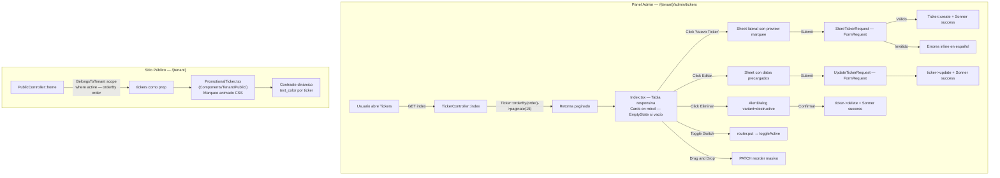

# Módulo: TICKERS PROMOCIONALES

## Descripción
Barra animada tipo marquee que muestra mensajes promocionales, avisos o links en el sitio público del tenant. Administrable desde el panel admin con control de contenido, colores, orden y estado.

## Clasificación
- **Tipo**: Transversal (compartido entre verticales)
- **Verticales**: Ecommerce, Gastronomía, Servicios
- **Scope**: Tenant-wide (sin `location_id`)
- **Límite por plan**: Sí (implementado en Planes y validado en admin)
- **Soft delete**: No

## Stack Técnico
- **Modelo**: `Ticker.php` (trait `BelongsToTenant`)
- **Controlador**: `Tenant/Admin/TickerController.php`
- **FormRequests**: `StoreTickerRequest.php`, `UpdateTickerRequest.php`
- **Frontend Admin**: `Pages/Tenant/Admin/Tickers/Index.tsx` (Inertia + React)
- **Frontend Público**: `Components/Tenant/Public/PromotionalTicker.tsx`
- **Types**: `resources/js/types/ticker.ts`
- **Estilos**: TailwindCSS + Shadcn UI

## Esquema de Base de Datos

| Campo | Tipo | Nullable | Default | Descripción |
|-------|------|----------|---------|-------------|
| `id` | bigint | No | auto | PK |
| `tenant_id` | foreignId | No | — | FK → tenants (cascade) |
| `content` | string(255) | No | — | Texto del ticker (soporta emojis) |
| `link` | string(255) | Sí | null | URL opcional al hacer click |
| `background_color` | string(10) | No | #000000 | Color de fondo (hex) |
| `text_color` | string(10) | No | #FFFFFF | Color del texto (hex) — **NUEVO** |
| `order` | integer | No | 0 | Orden de aparición — **NUEVO** |
| `is_active` | boolean | No | true | Activo/Inactivo |
| `created_at` | timestamp | — | — | — |
| `updated_at` | timestamp | — | — | — |

## Flujo de Trabajo

## Campos del Formulario (Sheet Admin)

| Campo | Componente | Validación |
|-------|-----------|------------|
| Contenido | `Input` + emoji picker (Popover) | required, string, max:255 |
| Color de fondo | Preset colors + Input hex + Input color | required, string, regex hex, max:10 |
| Color de texto | Preset colors + Input hex + Input color | required, string, regex hex, max:10 |
| Enlace | `Input` type url | nullable, url, max:255 |
| Orden | `Input` type number | required, integer, min:0 |
| Activo | `Switch` | boolean |
| **Preview** | Marquee animado con colores reales | — |

## Reglas de Negocio
1. **Orden manual**: Los tickers se muestran según el campo `order` (ascendente). El admin puede reordenar.
2. **Solo activos en público**: El sitio público solo muestra tickers con `is_active = true`.
3. **Contraste dinámico**: Cada ticker define su propio `text_color` para garantizar legibilidad sobre el `background_color`.
4. **Sin location_id**: Un ticker aplica a todo el tenant, no a una sede específica.
5. **Sin soft delete**: La eliminación es permanente. El contenido es efímero y recreable.

## Permisos
| Permiso | Descripción | Seeded |
|---------|-------------|--------|
| `tickers.view` | Ver listado de tickers | Sí |
| `tickers.create` | Crear tickers | Sí |
| `tickers.update` | Editar tickers | Sí |
| `tickers.delete` | Eliminar tickers | Sí |

## Archivos Afectados

### Nuevos
| Archivo | Descripción |
|---------|-------------|
| `app/Http/Requests/Tenant/Admin/StoreTickerRequest.php` | Validación para crear |
| `app/Http/Requests/Tenant/Admin/UpdateTickerRequest.php` | Validación para editar |
| `database/migrations/xxxx_add_order_and_text_color_to_tickers_table.php` | Nuevos campos |
| `resources/js/types/ticker.ts` | Type compartido |
| `resources/js/Components/Tenant/Public/PromotionalTicker.tsx` | Componente reubicado |

### Modificados
| Archivo | Cambios |
|---------|---------|
| `app/Models/Ticker.php` | Agregar `order`, `text_color` a fillable |
| `app/Http/Controllers/Tenant/Admin/TickerController.php` | FormRequests, paginate, select, reorder endpoint |
| `resources/js/Pages/Tenant/Admin/Tickers/Index.tsx` | Refactor completo: EmptyState, responsive, loading, text_color, order, preview real |
| `app/Http/Controllers/Tenant/Gastronomy/PublicController.php` | Usar scope del trait, orderBy order |
| `resources/js/Pages/Tenant/Gastronomy/Public/Home.tsx` | Actualizar import del componente reubicado |

### Eliminados
| Archivo | Razón |
|---------|-------|
| `resources/js/Components/Tenant/Gastronomy/Public/PromotionalTicker.tsx` | Reubicado a `Tenant/Public/` |

## Auditoría de Estándares
- [x] Multi-tenant isolation (`BelongsToTenant`)
- [x] FormRequest validation (prohibida validación inline)
- [x] Explicit TypeScript Types (No `any`)
- [x] Shadcn UI only (admin)
- [x] EmptyState con iconografía y CTA
- [x] AlertDialog `destructive` para eliminación
- [x] Sonner `bottom-center` con mensajes específicos
- [x] Loading states / Spinners en acciones async
- [x] Mobile-First (cards en móvil, tabla en desktop)
- [x] Paginación en backend (`paginate`)
- [x] Select específico (no `select *`)
- [x] 100% Español para usuario final
- [x] Componente público en carpeta transversal correcta

## QA / Paso QA

Checklist del protocolo de QA (`linkiu_qa_and_testing_protocol`). El módulo se considera **Paso QA** cuando se cumple todo lo siguiente:

| Criterio | Estado |
|----------|--------|
| Aislamiento tenant/sede verificado (no acceso a datos de otros tenants por URL) | Pendiente |
| Relaciones y eliminaciones sin huérfanos / comportamiento esperado | N/A (sin relaciones padre-hijo) |
| Formularios: vacíos, tipos incorrectos, longitudes; errores en español desde FormRequest | Pendiente |
| Búsqueda/filtros y EmptyState cuando no hay resultados | N/A (sin búsqueda) / EmptyState implementado |
| Paginación y preserveState de filtros | Implementado |
| Feedback (Spinner/Sonner) en Guardar/Eliminar | Implementado |
| AlertDialog en acciones destructivas | Implementado |
| Estados de carga (Skeleton/Spinner) en listado | Pendiente revisión |
| Responsividad móvil (sin overflow, touch targets, tabla → cards) | Implementado |
| Sin campos/relaciones innecesarios (N+1, select específico) | Implementado |
| Cero 422/500 no controlados en flujo normal | Pendiente |

*Actualizar estado a [x] o "Cumplido" tras ejecutar las pruebas correspondientes.*
