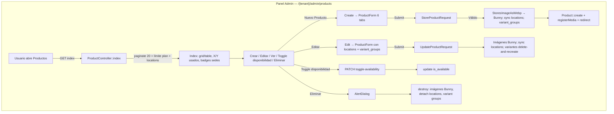

# Módulo: PRODUCTOS (Carta Digital Admin)

## Descripción
Catálogo de productos del menú (platos, bebidas) para la vertical Gastronomía. Administrable desde el panel admin: información básica, precios, imágenes (principal + galería), variantes/modificadores, detalles culinarios (alérgenos, tags), disponibilidad por sede e impuestos. Las imágenes se almacenan **solo en Bunny.net** (con compatibilidad de lectura para rutas legacy en S3). Los productos pueden asociarse a una o varias sedes mediante tabla pivote `product_location`.

## Clasificación
- **Tipo**: Central (vertical Gastronomía)
- **Verticales**: Gastronomía
- **Scope**: Por tenant; opcionalmente por sede (pivote `product_location`)
- **Límite por plan**: Sí (key `products` en `plans.limits`; en Super Admin se configura como "Máx. productos" en el módulo Carta digital)
- **Soft delete**: No

## Stack Técnico
- **Modelo**: `App\Models\Product` (trait `BelongsToTenant`), con `storage_disk`, relación `locations()` (BelongsToMany)
- **Controlador**: `Tenant/Admin/Gastronomy/ProductController.php` (Gate en todos los métodos; trait `StoresImageAsWebp`; transacciones DB)
- **FormRequests**: `StoreProductRequest.php`, `UpdateProductRequest.php` (Gate, validación scoped por tenant, mensajes en español)
- **Frontend Admin**: `Pages/Tenant/Admin/Gastronomy/Products/Index.tsx`, `Create.tsx`, `Edit.tsx`; componente `ProductForm.tsx`, `ProductViewDrawer.tsx`
- **Almacenamiento**: 100% Bunny para nuevos; lectura compatible con S3 vía `storage_disk`
- **Estilos**: TailwindCSS + Shadcn UI

## Esquema relevante
- **products**: `tenant_id`, `category_id`, `name`, `slug`, `price`, `image`, `storage_disk`, `gallery` (json), variantes vía `product_variant_groups` / `product_variant_options`, `product_location` (pivote) para multi-sede.
- **product_location**: `product_id`, `location_id`, `is_available`; único `(product_id, location_id)`.

## Flujo de Trabajo

## Reglas de Negocio
1. **Multi-sede**: Tabla pivote `product_location`. Sin locations asignadas = disponible en todas las sedes.
2. **Límite por plan**: `getLimit('products')` en store/create e index; UI muestra contador y deshabilita "Nuevo Producto" al tope.
3. **Imágenes**: Nuevos en Bunny (WebP); rutas `uploads/{tenant-slug}/products/` y `.../products/gallery/`. Legacy S3 sigue leyendo por `storage_disk`.
4. **Variantes**: Validación vía `$request->validated()`; en update se eliminan y recrean (order_items guardan snapshot JSON).
5. **IDOR**: `edit`, `update`, `destroy`, `toggleAvailability` verifican `product->tenant_id === currentTenant->id`.

## Estándares de implementación (checklist)
- [x] Gate en controller: `products.view`, `products.create`, `products.update`, `products.delete`.
- [x] FormRequests: authorize con Gate; `category_id` y `location_ids` validados contra tenant.
- [x] Transacciones DB en store, update, destroy.
- [x] Endpoint dedicado `PATCH products/{id}/toggle-availability`; confirmación AlertDialog + loading en toggle.
- [x] TypeScript sin `any`; interfaces para Product, PaginationLink, etc.
- [x] Empty state en Index; paginación con SharedPagination.
- [x] ProductViewDrawer con URLs Bunny y badges de sedes.
- [x] Permisos en seed: `products.view`, `products.create`, `products.update`, `products.delete`.

## Permisos
| Permiso | Descripción | Seeded |
|---------|-------------|--------|
| `products.view` | Ver listado y detalle de productos | Sí |
| `products.create` | Crear productos | Sí |
| `products.update` | Editar productos y toggle disponibilidad | Sí |
| `products.delete` | Eliminar productos | Sí |

## Auditoría
- **PRODUCTS_AUDIT.md**: informe de cumplimiento 100% según estándares de skills (IDOR, BunnyCDN, límite plan, multi-sede, tipos, UX).

## Archivos afectados
- **Backend**: `Product.php`, `ProductController.php`, `StoreProductRequest.php`, `UpdateProductRequest.php`, `routes/web.php`, migración `product_location` + `storage_disk`.
- **Frontend**: `Products/Index.tsx`, `Create.tsx`, `Edit.tsx`, `ProductForm.tsx`, `ProductViewDrawer.tsx`.
- **Config**: `menuConfig.ts` — `MODULE_HAS_LIMIT['digital_menu']`, `LIMIT_FORM_KEY_TO_BACKEND` / `LIMIT_BACKEND_KEY_TO_FORM`.
- **Seeders**: `PermissionSeeder.php` — permisos `products.*` módulo "Carta digital".
