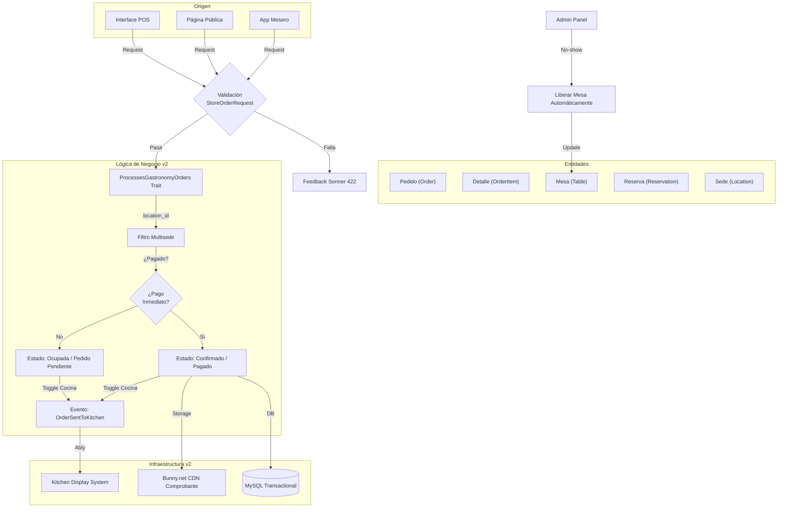

# SPEC.md: Módulo de Pedidos (Gastronomía v2)

Este documento define la arquitectura y el flujo lógico definitivo para el sistema de pedidos de Linkiu, cumpliendo con los estándares de multisede, seguridad y performance.

## Diagrama de Flujo (Mermaid)

## Reglas de Oro del Módulo

1.  **Aislamiento**: Todo `ORDER`, `TABLE` y `ZONE` debe filtrar por `location_id` y `tenant_id`.
2.  **Persistencia**: Uso obligatorio de `DB::beginTransaction()` en el Trait para garantizar que no haya pedidos sin items.
3.  **CDN**: Los comprobantes se sirven únicamente desde el disco `bunny`.
4.  **UX**: Toda acción destructiva o cambio de estado masivo requiere `AlertDialog`.
5.  **Caja/Cocina**: El flujo de caja no debe bloquear el flujo de cocina; el usuario decide si envía la orden.

## Mapeo técnico
- **Modelo**: [Order.php](file:///f:/linkiu.bio/app/Models/Tenant/Gastronomy/Order.php)
- **Trait Lógica**: [ProcessesGastronomyOrders.php](file:///f:/linkiu.bio/app/Traits/ProcessesGastronomyOrders.php)
- **Frontend POS**: [Index.tsx](file:///f:/linkiu.bio/resources/js/Pages/Tenant/Admin/Gastronomy/POS/Index.tsx)
