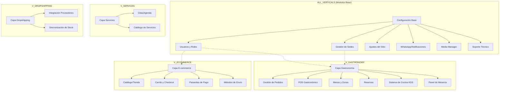

# Mapa de Verticales y Módulos

Este diagrama organiza todos los módulos del sistema según la vertical de negocio a la que pertenecen.

## Detalles de Sub-módulos e Integraciones

### 1. LinkiuLab (Analítica)
- Visitas y tráfico
- Secciones más vistas
- Conversiones
- Más vendidos
- Heatmaps

### 2. LinkiuPay
- Formulario
- Ofertas
- Estadísticas

### 3. Marketing Operativo
- **Cupones**: Gestión de descuentos.
- **Tickers**: Mensajes promocionales dinámicos.

