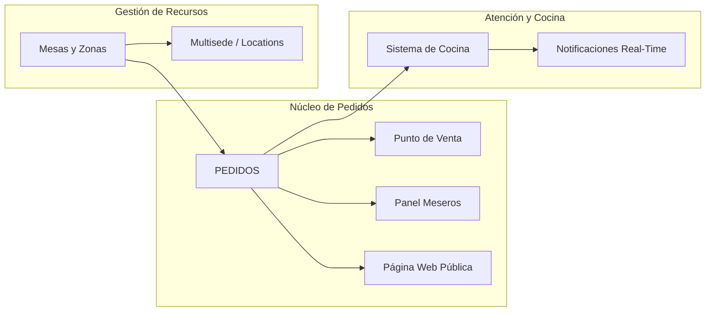

# Mapa Maestro: Vertical Gastronomía

Este documento es el eje central para mantener el contexto del sistema. Cada módulo se conecta aquí para visualizar la arquitectura global.

## 1. Conexiones Globales

## 2. Estado Actual de Auditoría

| Módulo | Estado | Spec / Diagrama | Notas |
| :--- | :--- | :--- | :--- |
| **Pedidos** | 🟡 Auditing | [PEDIDOS_FLOW.md](PEDIDOS_FLOW.md) | En revisión de lógica multisede. |
| **Mesas/Zonas** | ⚪ Pending | [MESAS_ZONAS_SPEC.md](MESAS_ZONAS_SPEC.md) | Requiere `location_id`. |
| **Cocina** | ⚪ Pending | [COCINA_SPEC.md](COCINA_SPEC.md) | - |
| **POS** | ⚪ Pending | - | Pendiente crear diagrama. |

---
> [!TIP]
> **Para la IA**: Si pierdes el contexto, lee primero este archivo para entender la jerarquía y sigue los enlaces a los archivos de detalle.
