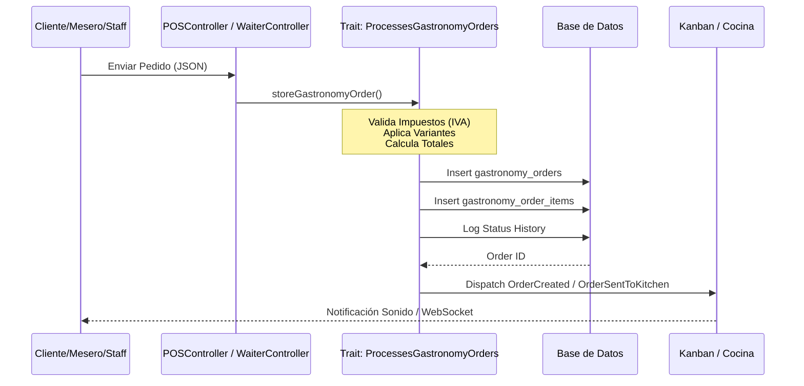

# Flujo Detallado: Módulo de Pedidos

Este archivo contiene la lógica técnica y de negocio del sistema de pedidos.

## 1. Diagrama de Flujo (Creación y Gestión)

## 2. Reglas de Negocio Críticas
- **Impuestos**: Se calculan en el servidor para evitar manipulaciones. El Trait lee la configuración del `tenant` o del `product` individual.
- **Variantes**: Pueden ajustar el precio base del producto.
- **Multisede (PENDIENTE)**: Actualmente el pedido es global. Se debe implementar `location_id` para filtrar por sede física.

## 3. Puntos de Auditoría Actuales
- Falta protección selectiva de `Gates`.
- El origen de pedidos públicos se marca erróneamente como "POS".
