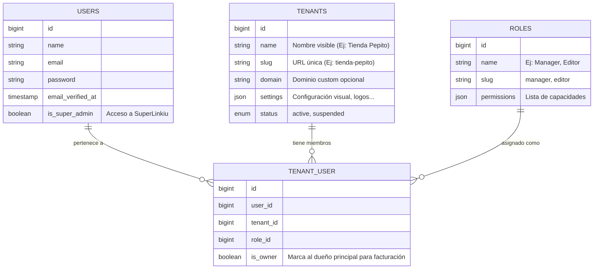

# Linkiu.bio - Schema de Base de Datos y Roles

Este documento define la estructura de datos Core y el sistema de permisos.

## 1. Modelo de Roles y Permisos

Utilizaremos una estrategia Híbrida:
1.  **System Level**: Roles globales que afectan a toda la plataforma (Tú y tu equipo).
2.  **Tenant Level**: Roles que solo existen DENTRO de un negocio específico.

### Definición de Roles (Jerarquía)

| Nivel | Rol | ID (Slug) | Descripción | Permisos Clave |
| :--- | :--- | :--- | :--- | :--- |
| **Plataforma** | **Super Admin** | `super_admin` | Tú (Dueño del SaaS). | Acceso total a `/superlinkiu`. Gestionar tenants, planes, facturación global. |
| **Plataforma** | **Support** | `platform_support` | Tu equipo de soporte. | Ver tenants, ayudar usuarios, pero NO borrar datos ni ver ingresos sensibles. |
| **Tenant** | **Owner** | `tenant_owner` | El cliente que paga. | Acceso total a SU negocio en `/{tenant}/admin`. Gestionar suscripción, invitar empleados. |
| **Tenant** | **Manager** | `tenant_manager` | Gerente de tienda. | Gestionar productos, órdenes, dropshipping. NO puede borrar la cuenta ni cambiar plan. |
| **Tenant** | **Editor** | `tenant_editor` | Empleado base. | Solo editar productos/contenido. |

---

## 2. Schema de Base de Datos (Tablas Core)

Uso de tablas pivote para manejar relaciones flexibles (Un usuario puede ser `Owner` de un negocio y `Editor` en otro).

### Explicación de Tablas

*   **`users`**: La identidad global. Un email = Un usuario.
*   **`tenants`**: Las "Organizaciones" o negocios. Linkiu Dropshipping vivirá colgado de aquí.
*   **`tenant_user`**: Tabla pivote crucial. Relaciona un `User` con un `Tenant` y le asigna un `Role` específico PARA ESE tenant.
    *   *Ventaja*: Un usuario puede tener 3 tiendas distintas con el mismo login.

---

## 3. Estrategia de Verticales (Futuro)

Para agregar la vertical **Dropshipping**, crearemos tablas que referencien `tenant_id`:

*   `products` (tenant_id, name, price...)
*   `dropshipping_providers` (tenant_id, api_key...)

De esta forma, la data está aislada por Tenant desde el diseño base.
